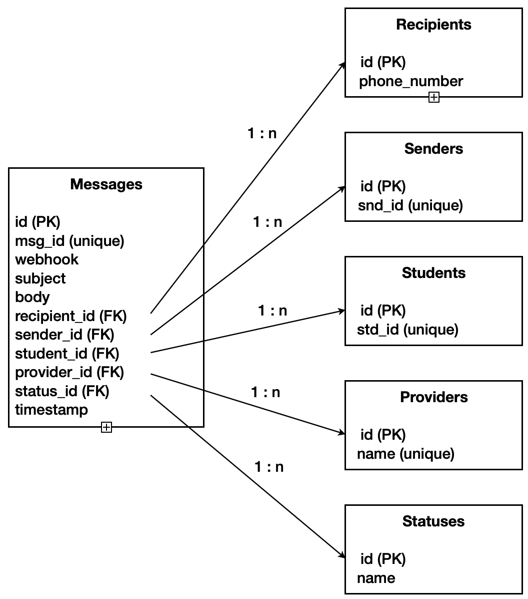

# Arbor Education: Technical Task
The application has 2 parts:
* Report Builder: build reports based on the data stored in the database.
* API Webservice: populate the database with data from a json file provided.

## Database Design
The database is structured as shown in the image below, illustrating the tables and their relationships used to store the data.

I added foreign keys to the `Messages` table to establish relationships with other entities. This ensures data consistency and referential integrity within the database.

Each table contains an `id` field that serves as the Primary Key and is used to establish Foreign Key relationships. Additionally, the tables include a secondary ID field, which is a string type. This field stores IDs from the source file but does not function as a key, although they are defined as `unique`.

## Software Architecture

## API Webservice

## Report Builder

## Installation

## 