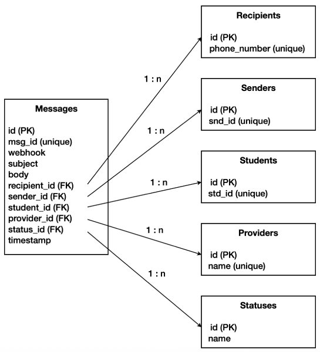

# Arbor Education: Technical Task
The application has 2 parts:
* API Webservice: populate the database with data from a json file provided.
* Reports Builder: build reports based on the data stored in the database.

## Database Design
The database is structured as shown in the image below, illustrating the tables and their relationships used to store the data.

I added foreign keys to the `Messages` table to establish relationships with other entities. This ensures data consistency and referential integrity within the database.

Each table contains an `id` field that serves as the Primary Key and is used to establish Foreign Key relationships. Additionally, the tables include a secondary ID field, which is a string type. This field stores IDs from the source file but does not function as a key, although they are defined as `unique`.

## Software Architecture
The application is developed using `Laravel 12` as PHP framework and a MySQL database.

### `.env` file
The configuration file `.env` is the root directory. It contains database configuration:
* `DB_CONNECTION=mysql`
* `DB_HOST=127.0.0.1`
* `DB_PORT=3306`
* `DB_DATABASE=arbor_education`
* `DB_USERNAME=root`
* `DB_PASSWORD=`

and some variables:
* `SMS_DATA_FILENAME="sms_data.json"`
* `MESSAGE_TYPE_SENT="SENT"`
* `MESSAGE_TYPE_DELIVERED="DELIVERED"`
* `MESSAGE_TYPE_FAILED="FAILED"`
* `MESSAGE_TYPE_REJECTED="REJECTED"`

### Controllers
The Controllers of the application are allocated under folder `./app/Http/Controllers/`:
* `IngestController.php` for the API Webservice.
* `ReportController.php` for the Reports Builder.

### Models
The Models are used for mapping the database tables and they are allocated under folder `./app/Models/`:
* `Message.php`
* `Provider.php`
* `Recipient.php`
* `Sender.php`
* `Status.php`
* `Student.php`

#### Migrations and Seeders
Migrations, under folder `./database/migrations/` are used to create the tables in the database. Also, a Seeder under folder `./database/seeders/` will populate table `Statutes` with the 4 valid values (SENT|DELIVERED|FAILED|REJECTED) provided in the requirements of the task, just after creating the tables.

### Classes and Interfaces
There are some Classes which implement Interfaces to build a software architecture based on abstraction, adhering to the Dependency Inversion principle.

Classes under folder `./app/Classes/`:
* `MessageFindableOrCreateable.php`
* `MessagesCounter.php`
* `MessagesList.php`
* `MessagesRater.php`
* `ProviderFindableOrCreateable.php`
* `RecipientFindableOrCreateable.php`
* `SenderFindableOrCreateable.php`
* `StatusFindable.php`
* `StudentFindableOrCreateable.php`

Interfaces under folder `./app/Interfaces/`:
* `CountableInterface.php`
* `FindableInterface.php`
* `FindableOrCreateableInterface.php`
* `ListableInterface.php`
* `RateableInterface.php`

### Views
The Views to display the reports are allocated under folder `./resources/views/`:
* `report_all.blade.php` for report with all the messages.
* `report_by_recipient.blade.php` for report with messages grouped by recipient.

## API Webservice
An API Webservice is implemented to populate the database with the data from a json file provided. This file contains a list of SMS messages, it is located under folder `./storage/school_messages/` and its filename is set in the config variable `SMS_DATA_FILENAME` in `.env` file (`sms_data.json` by default).

The service reads the content of the data file and inserts it in the database but if any of the messages or entities related already exist, it won't be inserted again.

It's assumed the the data file doesn't contain errors.

The service is managed by `IngestController` Controller and it can be called directly due to there isn't any restriction or authorisation method implemented, simply call this url in your browser:
* `http://my-domain/api/ingest`

## Reports Builder
The Reports Builder is a MVC Architecture application, managed by `ReportController` Controller. The data shown in the reports is retrieved from the database, previously populated by ths API Webservice.

It builds 2 types of reports:
* List of all messages which url is `http://my-domain/report_all`.
* List of messages grouped by recipient which url is `http://my-domain/report_by_recipient`.

The templates (Views) to render these reports are under folder `./resources/views/`.

## Install and run in `Local`
Follow the steps below to install and run the application in a `Local` server.

### Requirements and Installations
#### PHP >= 8.2
Execute this command in your terminal to install PHP 8.4:
`/bin/bash -c "$(curl -fsSL https://php.new/install/mac/8.4)"``

#### Composer
Follow these instructions to install `composer`:
`https://getcomposer.org/download/`

#### Node and NPM
Install Node.js and NPM from here:
`https://nodejs.org/en`

#### Git
Execute these commands in your terminal to install Git:
`/bin/bash -c "$(curl -fsSL https://raw.githubusercontent.com/Homebrew/install/HEAD/install.sh)"`
`brew install git`

### Download from GitHub
Download the application by clonning from a GitHub repository (preferably using `SSH` mode).

### Configuration
Update `.env` file, allocated in your application root directory, with your database configuration, ie:
* `DB_CONNECTION=mysql`
* `DB_HOST=127.0.0.1`
* `DB_PORT=3306`
* `DB_DATABASE=arbor_education`
* `DB_USERNAME=root`
* `DB_PASSWORD=`

### Run Migrations and Seeders
To create the database structure and populate table `statuses`, execute this command in your terminal from your application root directory;
`php artisan migrate:refresh --seed`

### Run a dev server
To run a dev server, execute this command in your terminal from your application root directory;
`composer run dev`

### Run the application
* Ingest the sms data file (populate the database):
** `http://127.0.0.1:8000/api/ingest`
* Run the reports builder:
** `http://127.0.0.1:8000/report_all`
** `http://127.0.0.1:8000/report_by_recipient`
